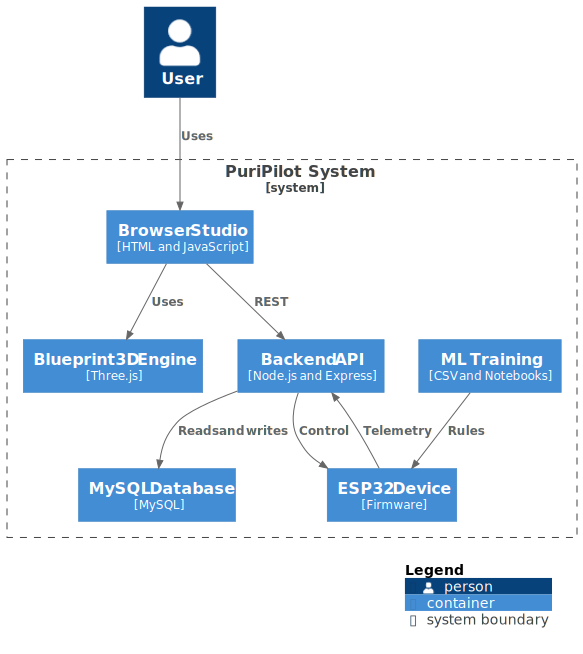

# PuriPilot (English)

▶ **[Watch PuriPilot Demo Video](https://www.google.com/search?q=docs/PuriPilot.mp4)** This is a demo video showing the 2D floor plan editing, device placement, and mode control flow with a brief opening.

-----

Conventional air purifiers rely solely on `fine dust + harmful gas sensors`.  
This leads to the following issues:

1.  When using air fresheners, diffusers, fabric deodorizers, perfumes, or cosmetics,  
    the air purifier excessively sucks in `harmless scent molecules`,  
    which can `unnecessarily shorten the filter lifespan`.
2.  Odors basically `diffuse across multiple rooms`, but  
    most products only `control a single device`, and  
    there are few features that control the entire house's air purifiers `simultaneously and contextually`.

**PuriPilot** is a **Smart Home AI-based Air Purifier Control Project** designed to solve these problems.

## PuriPilot Overview

PuriPilot addresses these issues with the following approach:

1.  Uses an **e-nose (electronic nose)** to learn `smell patterns`, and  
    only when the smell is identified as `unpleasant to humans`,
      - it increases the `air purifier operation mode` based on rules.
2.  Uses a **Room-Graph (Room Connection Graph)** to  
    control the entire house's air purifiers `simultaneously / contextually`.
3.  Allows users to **visually monitor and control** all operations via a **web-based floor plan UI**.

In summary, PuriPilot is a  
**Smart Home floor plan + 3D design demo capable of controlling LG PuriCare**,  
and is designed with **ESP32 + Sensors + Edge Impulse-based odor perception automation** in mind.

## Key Features

The PuriPilot demo provides the following features:

  - 2D Floor Plan Editing
  - Placement of multiple LG PuriCare devices
  - Device Bubble UI
      - Displays `id / name / mode / smell_class / last_seen`
  - Instant air purifier mode change from the UI
  - Persistent storage of floor plans and device info in MySQL
  - REST API exploration and testing via Swagger UI
  - Architecture considering ESP32 + e-nose + Edge Impulse integration
      - Odor pattern classification
      - Mode escalation only for unpleasant odors
      - Room-Graph based multi-device control

This repository is a **demo / experimental project** aiming for:

  - Smart Home UI/UX (2D floor plan + 3D-style device placement)
  - Management and control of multiple air purifiers
  - Verification of the integration structure between IoT devices and Web Backend

## Architecture Context


### **Frontend**
  - Runs in `example/` subfolder
  - 2D floor plan editing
  - Placement of LG PuriCare devices on the floor plan
  - Device status check and mode control via Bubble UI

### **Backend**
  - Node.js + Express
  - Persistent storage of floor plans and device states using MySQL
  - Provides REST API including Swagger UI

### **IoT / Inference (Planned Expansion)**
  - ESP32 + e-nose (Sensors for temperature, humidity, gas, etc.)
  - Edge Impulse based odor and air quality pattern classification
  - Rule-based logic to determine if an odor is unpleasant
  - Room-Graph based coordinated control of multiple air purifiers
  - ESP32 transmits status and prediction results to the backend

## Quick Start

### Prerequisites

  - Node.js 18 or higher
  - MySQL Instance (Local or Remote)

### Environment Setup

Create a `.env` file in the project root and configure it as follows:

```env
MYSQL_HOST=localhost
MYSQL_PORT=3306
MYSQL_USER=your_user
MYSQL_PASSWORD=your_password
MYSQL_DATABASE=puripilot_db
PORT=3001
```

PORT is for the backend HTTP server and is unrelated to the MySQL port.

### Installation & Execution

```
npm install
npm run start:server
```

The above commands perform the following:

  - Start Express server
  - Create MySQL tables and run migrations
  - Generate default LG PuriCare device seed data

Run the frontend in a separate terminal.

```
cd example
npx http-server .
```

### Access URLs

  - Frontend: http://localhost:8080
  - Backend API: http://localhost:3001
  - Swagger UI: http://localhost:3001/api/docs

## App Usage Method

### 1\. Edit Floor Plan

  - Create or modify the house structure in the 2D editor.
  - Click the Done button to automatically save the floor plan.

### 2\. Add LG PuriCare Devices

  - Select the `Add Items → Lg Puricare` menu.
  - Placing a device automatically creates a device row in MySQL.

### 3\. Check & Control Device Info

  - Go to the `Design` tab.
  - Select a device on the floor plan to display the Bubble UI.
  - Clicking the Mode button sends an immediate PATCH request.
  - You can modify the device name and save it.

This allows you to visually identify device locations within the home and intuitively manage multiple air purifiers from a single screen.

## ESP32 + Edge Impulse Integration

PuriPilot is designed with a structure that considers real IoT device integration.

  - Collect e-nose sensor data on ESP32
  - Train odor pattern models on Edge Impulse
  - Determine unpleasant odors based on inference results
  - Simultaneous control of air purifiers in adjacent rooms using Room-Graph
  - ESP32 periodically sends the following information to the backend:
  - Sensor data
  - Predicted `smell_class`
  - Status and timestamp

Future updates to this README will include:

1.  How to deploy Edge Impulse models to ESP32
2.  How to transmit inference results from ESP32 to the backend
3.  How to link ESP32 devices with PuriPilot `device_id` and Room-Graph

<!-- end list -->

```
NPM Scripts
$ npm run start:server
Runs Express + MySQL + Swagger server
$ npm run build
Builds client for browser (Browserify based)
$ npx http-server example -p 8080 -c-1 -o index.html
Runs frontend static server
```

## Repository

```
git@github.com:PuriPilot/Smart-Home-PuriPilot.git
```